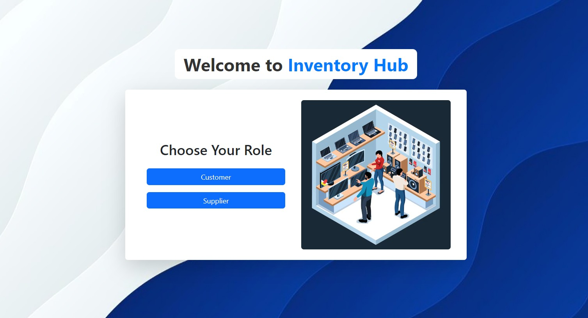

# 🛒 Inventory Management System

Welcome to the **Inventory Management System**!  
This is a full-stack web application built to streamline inventory control, order processing, and customer-supplier interactions.

---

<div align="center">
  
</div>

---
## 🚀 Features

### 🌟 Customer Features
- 🛒 **Place Orders**: Browse products and place orders.
- 📦 **View Orders**: Check order history and details.
- ❌ **Cancel Orders**: Cancel pending orders.
- ✏️ **Update Profile**: Edit personal information.
- 🔑 **Forgot Password**: Reset password via email.

### 🌟 Supplier Features
- ➕ **Add Products**: Add new products to the system.
- ✏️ **Update Products**: Edit product name, price, etc.
- 🗑️ **Delete Products**: Remove products from inventory.
- 📈 **Update Stock**: Manage and adjust stock levels.
- 📦 **Update Order Status**: Modify order statuses.
- 👥 **View Customers**: Access registered customer details.
- 🔒 **Toggle 2FA**: Enable/disable two-factor authentication for customers.

---

## 🛠️ Tech Stack

### 🖥️ Frontend
- ⚛️ **React.js**
- 🎨 **Bootstrap**
- 🌐 **React Router**

### 🖥️ Backend
- 🟢 **Node.js**
- 🔄 **Express.js**
- 🗄️ **MongoDB**
- 🔐 **JWT** for authentication

### 📧 Email Service
- **Mailjet** (for password reset, OTP, etc.)

---

## 📂 Project Structure

### Frontend (`Front-end/`)
```
src/
├── assets/              # Images and static files
├── components/          # Reusable components
├── pages/
│   ├── Customer_Pages/  # Customer dashboard pages
│   ├── Supplier_Pages/  # Supplier dashboard pages
├── App.js               # Main React component
├── index.js             # React DOM entry
└── styles.css           # Global styles
```

### Backend (`Back-end/`)
```
├── models/              # Mongoose data models
├── routes/              # API route definitions
├── controllers/         # Route handlers/business logic
├── middleware/          # Auth, validation, etc.
├── .env                 # Environment variables
├── server.js            # Application entry point
└── package.json         # Backend dependencies
```

---

## ⚙️ Installation & Setup

### Prerequisites
- 📦 Node.js
- 🗄️ MongoDB (local or cloud instance)

### Installation Steps

```bash
# 1. Clone the repository
git clone https://github.com/your-username/inventory-management-system.git
cd inventory-management-system

# 2. Setup Backend
cd Back-end
npm install

# 3. Setup Frontend
cd ../Front-end
npm install
```

### Environment Configuration

Update the `.env` file in the `Back-end/` directory with:

- MongoDB URI
- Mailjet API keys
- JWT secret
- Port configurations

### Running the App

```bash
# Start the backend
cd ../Back-end
npm run dev

# Start the frontend
cd ../Front-end
npm start
```

---

## 🌐 API Endpoints

### 🔐 Authentication
- `POST /api/customers/register` - Register customer  
- `POST /api/customers/login` - Customer login  
- `POST /api/suppliers/register` - Register supplier  
- `POST /api/suppliers/login` - Supplier login  

### 📦 Products
- `GET /api/products` - Fetch all products  
- `POST /api/products` - Add product (Supplier)  
- `PUT /api/products/:id` - Update product (Supplier)  
- `DELETE /api/products/:id` - Delete product (Supplier)  

### 📬 Orders
- `POST /api/orders` - Place new order (Customer)  
- `GET /api/orders` - Get all orders (Supplier)  
- `PUT /api/orders/:id/status` - Update order status (Supplier)  

---

## 📸 Screenshots

### 🔹 Landing Page  


### 🔹 Customer Dashboard  


### 🔹 Supplier Dashboard  


---

## 🧑‍💻 Contributors

- **Soumyojyoti Saha** – [GitHub Profile](https://github.com/soumyojyotisaha)

---

## 📜 License

This project is licensed under the **MIT License**. See the [LICENSE](LICENSE) file for more information.

---

## 📞 Contact

For feedback or inquiries:  
📧 **Email**: [soumyojyotisaha2001offic@gmail.com](mailto:soumyojyotisaha2001offic@gmail.com)

